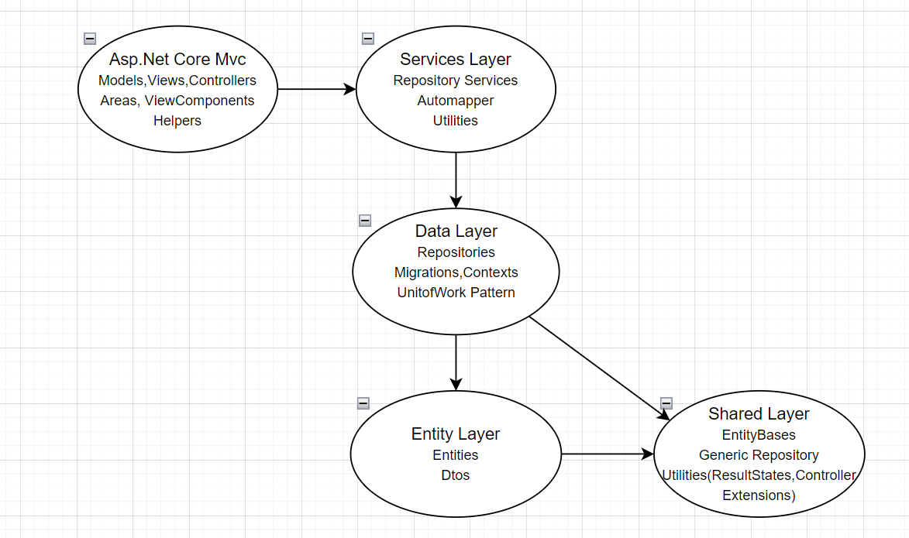
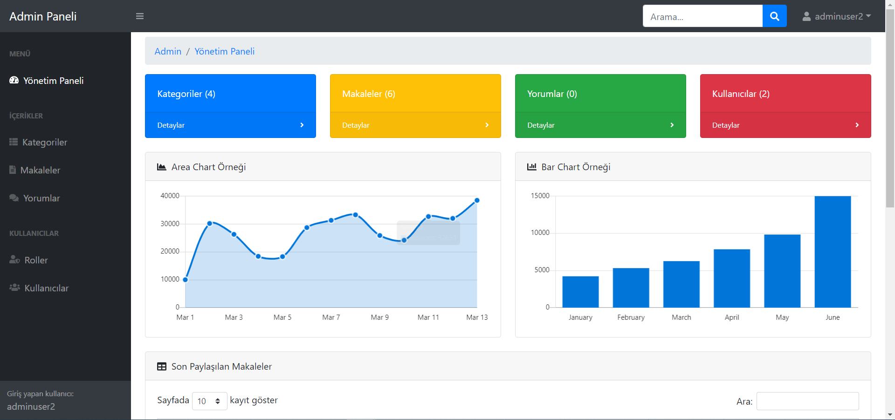
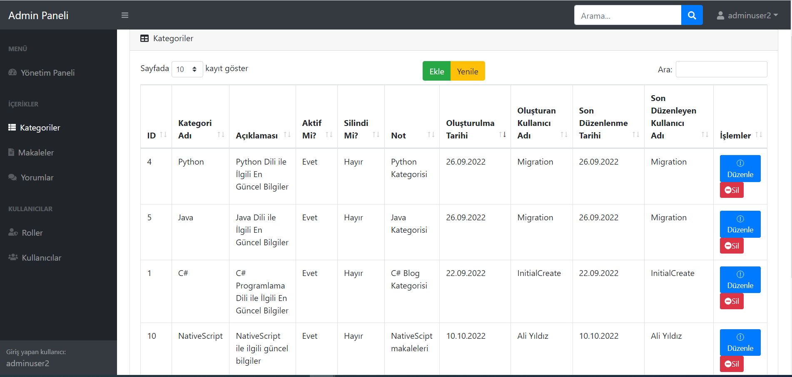
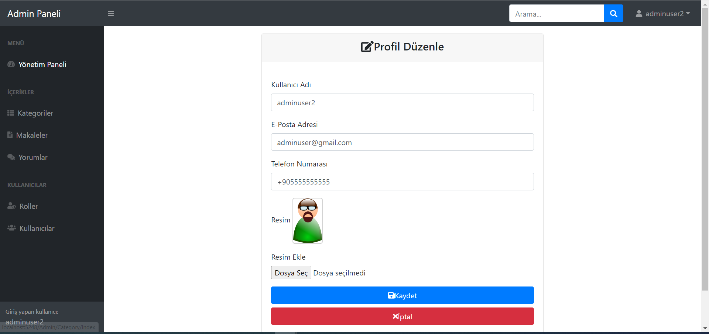

<h1>Blog Proje</h1>
<h3>1. Giriş</h3>

Geliştirilen bu blog projesi, kullanıcıların çeşitli konularda makale yazdığı ve bunları diğer kullanıcılar ile paylaştığı bir platformdur. Projede ayrıca admin paneli bulunmaktadır. Gerçekleştirilen bu işlemler güvenilir ve ölçeklenebilir bir alt yapıda ele alınmıştır.

<h3>2. Kullanılan Teknolojiler</h3>
Asp.Net Core Mvc, EntityFramework Core, N-Tier Architecture, AutoMapper, Ajax, MSSQL

<b>Kullanılan Dil:</b> C#

<h3>3. Projede Kullanılan Mimarinin Genel Hatları</h3>

<h3>4. Proje Ekran Görüntüleri</h3>

<h3>5. Kurulum: </h3>
 - Projede ProgrammersBlog.Mvc katmanında appsettings.json dosyasını açınız, ConnectionStrings kısmında belirtilen veritabanı bağlantı dizesini kendi veritabanı bağlantı dizenize göre güncelleyiniz. 
 - Ardından Visual Studio aracının üst sekmesinden view -> other windows -> package manager console kısmına tıklayınız. 
 - Ardından açılan pencerede default project yazan yere tıklayıp açılan seçim ekranından ProgrammersBlog.Data katmanını seçiniz. 
 - Açılan pencereye "update-database" yazıp enter'a tıklayınız.(ilgili veritabanı ve tabloları SSMS'de oluşacaktır.) 
 - Ardından ProgrammersBlog.Mvc projesine sağ tık yapıp "Set as Startup Project" deyiniz ve projeyi ayağa kaldırınız.

<b>Not: </b> Kullandığım veritabanı dosyası(uygulamaya hazır entegre etmek isteyenler için): ProgrammersBlog.bak

