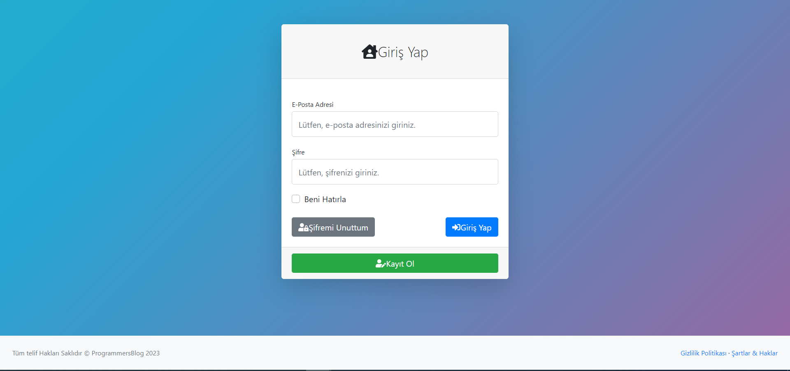

<h1>Blog Proje</h1>

Geliştirilen bu blog projesi, kullanıcıların çeşitli konularda makale yazdığı ve bunları diğer kullanıcılar ile paylaştığı bir platformdur. Projede ayrıca admin paneli bulunmaktadır. Gerçekleştirilen bu işlemler güvenilir ve ölçeklenebilir bir alt yapıda ele alınmıştır.

<h3>1. Kullanılan Teknolojiler</h3>
Asp.Net Core Mvc, EntityFramework Core, N-Tier Architecture, AutoMapper, Ajax, MSSQL

<b>Kullanılan Dil:</b> C#

<h3>2. Projede Kullanılan Mimarinin Genel Hatları</h3>

<h3>3. Proje Ekran Görüntüleri</h3>

<b>Not: </b> Kullandığım veritabanı dosyası(uygulamaya hazır entegre etmek isteyenler için): ProgrammersBlog.bak

